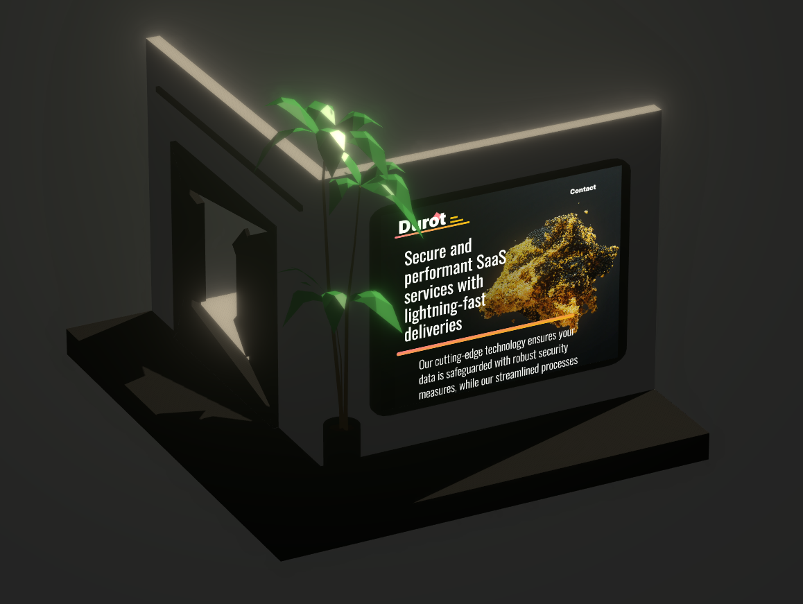

# vite-app <br> [](https://github.com/gmarcha/vite-app/actions/workflows/ci.yaml)

A 3D landing page built with Typescript, Vite, React-Three-Fiber (r3f) and Blender.

[](https://www.typescriptlang.org/docs/)

[](https://react.dev/learn)
[](https://docs.blender.org/manual/en/latest/)

## Example

[](https://gmarcha.com)

## Requirements

- `make`[^1] with:
  - `node` and `pnpm` installed locally[^2] or,
  - `docker` and `compose` plugin installed locally[^3] or,
  - `kubectl` with a `KUBECONFIG` file configured to a running cluster[^4][^5].

## Usage

Use Make to streamline local development for this project (like a task-runner with straightforward rules). Launch project locally via `node` with `pnpm` (1), `docker` with `compose` plugin (2), or `kubectl` with a configured Kubernetes cluster (3). Note that these rules are tailored for local use and aren't intended for production scenarios. For example:

```bash
make docker.all
```

### Node usage

Simple application lifecycle management with these rules:

- `node.all`: Installs dependencies, builds the project, and starts it.
- `node.install`: Install project dependencies using pnpm.
- `node.dev`: Start the project in development mode using pnpm.
- `node.build`: Build the project.
- `node.start`: Start the project in preview mode.

### Docker usage

Multi-service and flexible application lifecycle management with `docker compose` using these rules:

- `docker.all`: Build images, pull the latest versions, and start containers.
- `docker.clean`: Stop containers, remove images, and clean up volumes.
- `docker.build`: Build compose images.
- `docker.pull`: Pull the latest image for a specific service.
- `docker.up`: Start compose containers in detached mode.
- `docker.down`: Stop compose containers for a specific service.
- `docker.down.images`: Stop containers and remove associated images.
- `docker.down.volumes`: Stop containers and delete volumes.
- `docker.ps`: List containers for a specific service in JSON format.
- `docker.top`: Display running processes of a specific container.
- `docker.events`: Stream Docker events for a specific service in JSON format.
- `docker.logs`: Stream logs for containers or a specific service.
- `docker.exec`: Execute a command inside a specific container. Require SVC, CMD values.
- `docker.cp.from`: Copy files from a container to the host. Require SVC, SRC, DST values.
- `docker.cp.to`: Copy files from the host to a container. Require SVC, SRC, DST values.

Docker rules can optionally take a SVC parameter to use command on a specific service.

### Kubernetes usage

Manage and monitor Kubernetes resources using Kustomize with these rules:

- `k8s.apply`: Apply Kubernetes resources defined in `deploy/`.
- `k8s.delete`: Delete Kubernetes resources defined in `deploy/`.
- `k8s.get`: Retrieve and display Kubernetes resources from `deploy/`.
- `k8s.describe`: Describe Kubernetes resources from `deploy/`.
- `k8s.logs`: Stream logs from Kubernetes resources in `deploy/`.

## Guides

### Run application with `node` and `pnpm`

Node is an execution environment for javascript code and pnpm is a modern package manager for npm packages.

1. Install `node` for your os-family from [nodesources](https://github.com/nodesource/distributions):
  - Debian based
```bash
curl -fsSL https://deb.nodesource.com/setup_lts.x | sudo -E bash - &&\
sudo apt-get install -y nodejs
```
  - Redhat based
```bash
curl -fsSL https://rpm.nodesource.com/setup_lts.x | sudo bash -
```

2. Install `pnpm` package manager globally with `npm`:
```bash
npm i -g pnpm
```

3. Install application dependencies locally:
```bash
pnpm i
```

4. Run application in development mode (with hot-reloading functionality):
```bash
pnpm dev
```

### Install a local Kubernetes cluster with `k3d`

K3d is a wrapper around K3s Kubernetes distribution to run a Kubernetes cluster with Docker containers rather than virtual machines. K3s is a lightweight, flexible and ready-to-use distribution to create Kubernetes nodes. It offers ability to run schedulable server nodes or agent nodes, thus allowing setup from single-node cluster to high-availability cluster through a various range of scenarios. It has multiple pre-installed components as an internal core-dns server, a traefik reverse-proxy, a local-path storage provider and a metrics server, which can all be disabled on installation. K3d runs each K3s nodes and each internal load balancers services as a container, providing a very straightforward local developement or automated testing environment.

1. Install `k3d` with bash script from rancher's repository:
```bash
curl -fsSL https://raw.githubusercontent.com/k3d-io/k3d/main/install.sh | bash
```

2. Create a cluster[^7] with 3 servers nodes and 2 agents nodes (optional) with `k3d` cli:
```bash
k3d cluster create my-cluster --servers 3 --agents 2 -p "8080:80@loadbalancer" -p "8443:443@loadbalancer"
```

3. Verify that nodes are up and running:
```bash
kubectl get nodes
```

4. Build a container image based on `Dockerfile.prod` and tag it with your username:
```bash
docker build -t gmarcha/vite-app:latest -t gmarcha/vite-app:0.0.1 -f Dockerfile.prod .
```

5. Then update container image name and tag in `/deploy/deployment.yaml` (or build your image tag based on used tag) and remove image pull secrets configuration.

6. Update host value from `gmarcha.com` to `vite.localhost` in ingress ressource into `/deploy/ingress.yaml` (or redirect existing domain to localhost) and remove tls-related configuration.

7. Apply Kubernetes manifests in `/deploy` directory with kustomize:
```bash
kubectl apply -k deploy/
```

8. Monitor pod status with kubectl and wait its readiness:
```bash
kubectl get pod -k deploy/
```

9. Then access application with curl or directly in browser at http://vite.localhost:8080

10. Delete Kubernetes resources contained in manifests in `/deploy` directory with kustomize again:
```bash
kubectl delete -k deploy/
```

11. Delete `k3d` cluster:
```bash
k3d cluster delete my-cluster
```

### Create JSX or TSX components from GLTF models using `@react-three/gltfjsx`

1. Download free 3D models in GLTF/GLB format or export/convert models from blender.

2. Use `npx` command with a docker container if node is not installed locally (optional):
```bash
echo "alias npx='docker run -it --rm ${PWD}:/app -w /app node npx'" | tee -a ~/.bashrc > /dev/null
```

3. Use `gltfjsx` command with `npx` to convert from `glb` file to `jsx` file (with shadow projection):
```bash
npx gltfjsx -s model.glb
```

4. Or use `gltfjsx` command to convert from `glb` file to `tsx` file:
```bash
npx gltfjsx -st model.glb
```

## Repository

Repository contains javascript/typescript, static assets and configuration resources for a Vite application.

`Vite` uses a static HTML file as entrypoint (`/index.html`) and loads modules in javascript or typescript format. In development mode, `Vite` starts a node server to watch change in `/src` directory and provide hot-reload functionality. In production mode, there are two steps. At first, you need to use `Vite` to build your application into static content in a `/dist` directory. Then you serve it with an express-like server (or any node-compatible environment) on a dedicated server or through any static content delivery service like `Netlify`, `Cloudflare`, `Vercel`, etc...

Static resources in `/dist` directory are bundled, minified and optimized `Javascript` assets built by a typescript-compiler from source code containing typescript-react components. `Typescript` adds a strong-typing system which improves drastically code completion and error detection from a developer perspective. Components are written with `React` because even if, nowadays, "vanilla" javascript has built-in high-level functionalities, `React` became a lot like node itself: it is not only used for the reason that it provides great benefits but rather than it has a rich and strong ecosystem. Various node libraries offers built-in integration for react and numerous libraries are even built-on react hooks or `JSX` functionalities. `JSX` (or `TSX` for typescript) is the format used in react ecosystem to write `HTML` templates.

Styles are directly written in components thanks to `Emotion` "css-in-js" engine (except for those generated by create-vite template). It integrates flawlessly with existing css-component libraries like `Tailwindcss`. You could use react-ui-component libraries such as `Mantine` (or more opinionated `MaterialUI`) to import ready-to-use components for layouts, form inputs, theming (dark, light, others), notification system... `Mantine` components are fully customizable through `Emotion` API. Global `CSS` directives should be avoided to ensure maintainability (!important directives notably).

For 3D integration, three.js is a very known library in javascript ecosystem. It provides a wrapper on WebGL to create scenes, cameras, meshes in web canvas. Nevertheless it is still complex to design performant 3D interfaces with a "simple" library. You should use react-three-fiber ecosystem as a framework to build such a system. It provides react components with out-of-the-box functionalities through libraries such as `@react-three/fiber`, `@react-three/drei` (++), `@react-three/a11y` or `@react-three/postprocessing`. Thus it leverages react hydration capabilities to provide dynamic, flexible and very efficient interfaces.

Use `node`/`pnpm` to start and use project locally. You could like to use `docker compose` to integrate other services with a `Vite` application, manage multiple applications or to build a micro-service architecture. However micro-service architecture depends on complex interconnectivity between components of an ecosystem, thus requires intensive proxying or a service-mesh based architecture. Kubernetes helps to leverage this kind of architecture.

### `/` repository root

- Configuration related to repository or application lifecycle lies on repository root:
  - repository configuration (`/.gitignore`, `/.gitattributes`),
  - application lifecycle management (`/Makefile`, `/Dockerfile.{dev,prod}`, `/docker-compose.yaml`),
  - application configuration (`/package.json`, `/tsconfig*.json`, `/vite.config.ts` and `/.eslintrc.cjs`),
  - application entrypoint (`/index.html`).

### `/src` directory

- Contains application source code in `*.tsx` format,
  - application code entrypoint (root react element) in `/src/main.tsx`,
  - application main component (app component) in `/src/App.tsx`,
  - application components in `/src/components/**/*.tsx` (such as `@react-three/gltfjsx` components[^6]),
  - internal static assets in `/src/assets/**/*` (such as `*.svg` and `*.glb` 3D models).

### `/public` directory

- Contains public static assets, i.e. statically served to users (contrarly to `/src/assets/` directory, only accessible internally).
  - application favicon (`/public/palm-tree-icon.png`).

### `/dist` directory

- Contains static resources to serve application content in production,
  - HTML and public resources in `/dist/**/*`,
  - javascript and internal assets in `/dist/assets/**/*`.

### `/.github/` directory

- Contains `Github Actions` workflows to build and push application image on registry (here, ghcr.io) on `push/tags` events,
  - pipeline in `/.github/workflows/ci.yaml` (based on `Docker` public actions).

### `/deploy` directory

- Contains `Kubernetes` `YAML` manifests to deploy application in production,
  - application manifests are stored in the same repository as the source code,
  - infrastructure manifests live on their own repository-ies,
- Contains sample Kubernetes resources for a deployment,
  - a clusterIP service,
  - a secured ingress serving one host,
  - a deployment for a pod with one container based on image hosted on private registry.

## Toolchain

### Programming Languages: Typescript/Javascript

Typescript is a superset of JavaScript that introduces static typing (so code completion), enhancing code reliability and maintainability. Code quality is highly improved, reducing runtime errors. Typescript sources are compiled into Javascript code. Javascript remains the core scripting language for web development, powering interactive web applications.

- Documentation: [Typescript Docs](https://www.typescriptlang.org/docs/)
- Documentation: [Javascript MDN Web Docs](https://developer.mozilla.org/en-US/docs/Web/JavaScript)

### Build Tool: Vite

Vite is a modern build tool and development server designed to optimize frontend development workflows. It's particularly well-suited for building simple single-page applications quickly with a strong emphasize on fast development. Moreover `Vite` is non-opinionated about what component library you are using: it works out-of-the-box with Vue, React, Preact, Svelte and more! It also works with both typescript and javascript. It can use SWC rust-based compiler for typescript-react projects.

- Documentation: [Vite Getting Started](https://vitejs.dev/guide/)
- Github repository: [@vitejs/plugin-react-swc](https://github.com/vitejs/vite-plugin-react-swc)

### Javascript Library: React

React is a widely adopted Javascript library for creating interactive user interfaces. It employs a component-based architecture, allowing developers to build and to shape UI with reusable components efficiently. React is particularly optimized to hydrate components based on data change, handled through built-in or custom hooks. In my opinion, JSX/TSX templating system is more developer friendly than a pure templating system such as Svelte/Vue, which has non-trivial caveats in complex situations. It has a vast ecosystem ranging from a wide range of frameworks (Next.js, Remix, Blitz) with various design standard to a plenty of react-ui-component libraries (MaterialUI, Mantine, ChakraUI) with different integration methods.

- Documentation: [React Documentation](https://react.dev/learn)
- Documentation: [Next Documentation](https://nextjs.org/docs)
- Documentation: [Remix Documentation](https://remix.run/docs/en/main)
- Documentation: [Mantine Documentation](https://mantine.dev/pages/getting-started/)
- Documentation: [ChakraUI Documentation](https://chakra-ui.com/getting-started)

---

### Javascript 3D Library: Three.js

Three.js is a popular Javascript library simplifying 3D graphics and animations in web browsers. It allows to create simple objects based on WebGL features. Those objects are scenes, meshes, cameras, lights, physics and effects for example. Nowadays you can even use it to create advanced graphics based on ray-casting, to import 3D models into web application or to render VR environment. Three still has a difficult learning curve and is very complex to implement clean data changes and user interactions.

- Documentation: [Three.js Documentation](https://threejs.org/docs/index.html#manual/en/introduction/Creating-a-scene)
- Examples: [Three.js Examples](https://threejs.org/examples/#webgl_animation_keyframes)

### React 3D Library: React-Three-Fiber (r3f)

React-Three-Fiber leverages the power of React and Three.js, providing a declarative approach to integrating 3D graphics into React applications. It allows to write three objects in a JSX or TSX fashion, thus allowing users to create complex scenes tightly integrated with react-components lifecycle. Additionally react-three project supplies plenty of libraries to handle various use-cases: `@react-three/fiber` for basic hooks and components, `@react-three/drei` for advanced components, `@react-three/a11y` for accesibility and interactivity, `@react-three/postprocessing` for astonishing and dead-simple render effects, `@react-three/gltfjsx` to convert 3D model from `*.glb` to `*.{j,t}sx` components, `@react-three/xr` to handle VR/AR events, and a lot more...

- Documentation: [@react-three/fiber Documentation](https://docs.pmnd.rs/react-three-fiber/getting-started/your-first-scene)
- Github repository: [@react-three/drei Documentation](https://github.com/pmndrs/drei)
- Github repository: [@react-three/a11y Documentation](https://github.com/pmndrs/react-three-a11y)
- Github repository: [@react-three/postprocessing Documentation](https://github.com/pmndrs/react-postprocessing)
- Github repository: [@react-three/gltfjsx Documentation](https://github.com/pmndrs/gltfjsx)
- Github repository: [@react-three/xr Documentation](https://github.com/pmndrs/react-xr)
- Examples: [React-Three-Fiber Examples](https://docs.pmnd.rs/react-three-fiber/getting-started/examples)

### 3D Modeling Software: Blender

Blender is a versatile open-source 3D creation suite suitable for a wide range of tasks, including modeling, animating, rendering, and more. It can be harnessed to model complex 3D scenes with sculpting, texture shading, or even geometry-nodes based tools. Then it has the capability to export 3D models, materials and animation sequences in a specific format to a future integration in a web, desktop or game application. It can also be utilized to render content directly in Blender tool suite and export images, animated content, videos.

- Documentation: [Blender Manual 3.6.1](https://docs.blender.org/manual/en/3.6/?utm_source=blender-3.6.1)
- Tutorials: [Blender Youtube Playlist](https://www.blender.org/support/tutorials/)

---

### Build Automation: Make

Make is a versatile build automation tool employing "Makefiles" to define tasks and dependencies. It helps streamline project workflows and build processes. Although more modern build tools exists, Make serves as a very lightweight task-runners to bootstrap projects or "glue" tasks in a local environment. It replaces `json-scripts` in language-agnostic environment.

- Documentation: [GNU Make Manual](https://www.gnu.org/software/make/manual/make.html)

### Containerization: Docker

Docker is a widely-used platform for creating, deploying, and managing containers. Containers provide a consistent and isolated environment for applications, ensuring that they run reliably across various environments. This is particularly useful for flexible local development practices (in comparison to development in virtual machines).

- Documentation: [Docker Documentation](https://docs.docker.com/)
- Documentation: [Dockerfile Reference](https://docs.docker.com/engine/reference/builder/)
- Container registry: [Dockerhub Registry](https://hub.docker.com/search?q=)

### Container Orchestration: Kubernetes

Kubernetes is an open-source container orchestration platform that automates the deployment and management of containerized applications with a declarative approach. It enables efficient management of computing resources, simplifies tasks such as load balancing/scaling/rollouts, enhances observability and supports multi-cloud architectures. Such requirements are handled with cloud-native service mesh (Istio, Linkerd) and multi-cluster control planes (Karmada, Kubesphere) for example. For managing Kubernetes application, there are Kustomize and Helm. Kustomize offers ability to merge custom patches with existing Kubernetes manifests, thus providing a lightweight overlay configuration system. It also avoids the need to fork repository when deploying application based on non-owned manifests. On the other hand, Helm is the Kubernetes package manager. It allows to package various Kubernetes resources under a chart, easing application deployment and customization with Go templating system. ArtifactHub is a Kubernetes package registry to register Helm repositories or distribute Helm charts and other Kubernetes resources.

- Documentation: [Kubernetes Documentation](https://kubernetes.io/docs/home/)
- Documentation: [Kubectl and Kustomize Documentation](https://kubectl.docs.kubernetes.io/guides/)
- Documentation: [Helm Documentation](https://helm.sh/fr/docs/intro/quickstart/)
- Kubernetes registry: [Artifact Hub](https://artifacthub.io/)

## Roadmap

- Add animation to `*.glb` 3D models.
- Migrate from `vite` to `nextjs` (from a single-page application to a hybrid server-sided renderer)?

## Author

[@gmarcha](https://github.com/gmarcha)

## License

[](https://opensource.org/licenses/Apache-2.0)

[^1]: `sudo apt install make`, `sudo dnf install make`,  or building from [source](https://ftp.gnu.org/gnu/make/) for non-managed distros.
[^2]: [follow instructions](https://github.com/nodesource/distributions) depending on your os-family, then install pnpm globally with node default package manager, npm: `npm -g i pnpm`.
[^3]: [follow instructions](https://docs.docker.com/engine/install/#server) for server (and not desktop) version depending on your distribution, then [follow post-install instructions](https://docs.docker.com/engine/install/linux-postinstall/).
[^4]: [install kubectl](https://kubernetes.io/docs/tasks/tools/install-kubectl-linux/), [install k3d](https://k3d.io/v5.5.2/#installation) to run a local cluster with docker ([configure k3d](https://k3d.io/v5.5.2/usage/exposing_services/)).
[^5]: replace `.spec.template.spec.containers.[0].image` by your own image name and tag in `/deploy/deployment.yaml` (be careful to create secret containing credentials - username, password - for private registry).
[^6]: use `npx gltfjsx -ts <model.glb>` to create TSX component (with shadows) from gltf model.
[^7]: k3s server nodes are schedulable by default (see [documentation](https://docs.k3s.io/advanced#node-labels-and-taints)) and k3s support single-node server cluster (be careful, k3s doesn't support adding servers to single-node setup).
